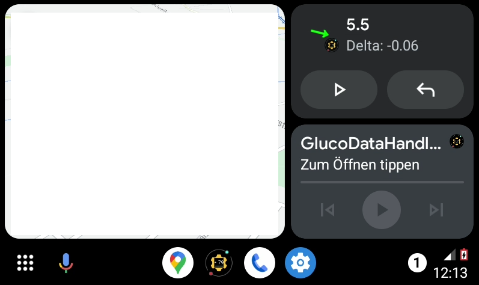

[ English version](README.md)  
[ Wersja polska](README_PL.md)

# GlucoDataAuto

Nachdem der Android Auto Teil von [GlucoDataHandler](https://github.com/pachi81/GlucoDataHandler/blob/master/README_DE.md) gegen die Richtlinien von Google Play verstosen hat, wurde dieser Teil in eine extra App namens GlucoDataAuto ausgelagert.
Diese App empfängt sowohl die Glukosewerte, als auch die Einstellungen von GlucoDataHandler.

Alternativ kann sie auch als eigenständige App verwendet werden.

## Option #1: Fake Media Player
Wenn sie nicht über Android Auto Musik hören, können sie die Media Player Unterstützung verwenden:

Um den Media Player für die geteilte Ansicht (Coolwalk) zu aktivieren, die Wiedergabe in einen anderen Media Player stoppen und in GlucoDataAuto auf Play drücken.

## Option #2: Benachrichtigungen verwenden

Alternativ zum Media Player kann die Android Auto Benachrichtigung verwendet werden:

 

INFO: das Benachrichtigungs Popup erscheint bei jedem neuen Wert.

## Option #3: APP verwenden

# Android Auto Installieren

Lade die letzte Version von `GlucoDataAuto_#.#.apk` von [hier](https://github.com/pachi81/GlucoDataAuto/releases) auf das Smartphone herunter und installiere sie (dafür muss die Installation von unbekannten Quellen erlaubt werden).

Android Auto ist entweder eine separate App oder Bestandteil vom System und kann über die Android Einstellungen geöffnet werden.

Um GlucoDataAuto in Android Auto zu verwenden, müssen die folgende Schritte durchgeführt werden:

## 1. Entwicklereinstellungen aktivieren

- Android Auto öffnen
- bis zu Version scrollen
- mehrfach auf Version drücken bis ein Popup mit `Entwicklereinstellungen zulassen` kommt
- `OK` drücken

## 2. "Unbekannte Quellen" aktivieren

- Android Auto öffnen
- in den 3-Punkt Menü `Entwicklereinstellungen auswählen`
- bis zu `Unbekannte Quellen` scrollen und aktivieren

## 3. Benachrichtigungen aktivieren

- Android Auto öffnen
- bis zu `Messaging` scrollen
- `Benachrichtigungen für Nachrichten anzeigen` aktivieren
- `Erste Zeile einer Nachricht anzeigen` aktivieren

## 4. GlucoDataAuto aktivieren

- Android Auto öffnen
- bis zu `Display` scrollen
- `Launcher anpassen` öffnen
- `GlucoDataAuto` aktivieren

Ist GlucoDataAuto nicht verfügbar, bitte das Telefon neustarten.

# Unterstützt meine Arbeit
[🍺 Buy me a beer](https://www.buymeacoffee.com/pachi81)

[Paypal me](https://paypal.me/pachi81)
