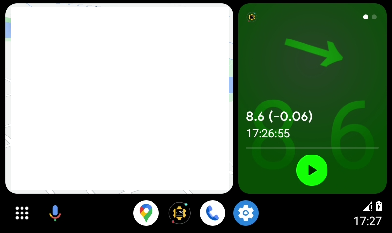
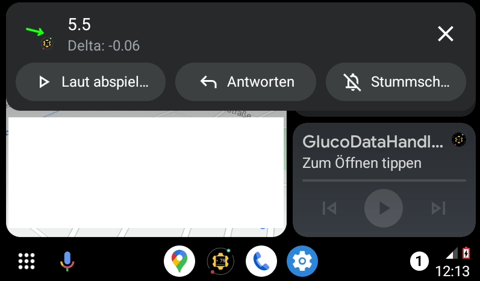
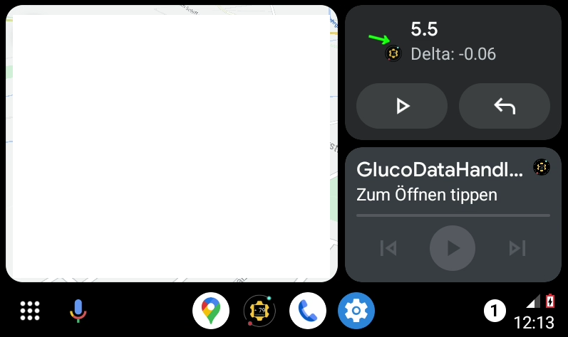
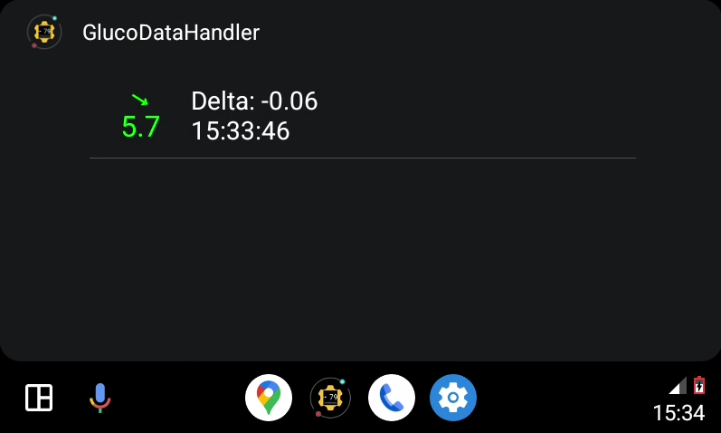

[ English version](README.md)  
[ Deutsche Version](README_DE.md)

# GlucoDataAuto

Ze względu na to, że część aplikacji [GlucoDataHandler](https://github.com/pachi81/GlucoDataHandler/blob/master/README_PL.md) dotycząca Android Auto nie spełnia wymagań polityk sklepu Google Play, została ona przeniesiona do dodatkowej aplikacji pod nazwą GlucoDataAuto, która odbiera ustawienia i wartości glukozy z GlucoDataHandler.

Może ona być też używana jako samodzielna aplikacja.

## Opcja nr 1: Korzystanie z fikcyjnego odtwarzacza multimediów
Jeśli nie używasz żadnego odtwarzacza multimedialnego w Android Auto do słuchania muzyki, możesz użyć aplikacji GlucoDataAuto, aby wyświetlić jego wartości w wiadomościach dotyczących multimediów:

Aby włączyć odtwarzacz multimedialny do podzielonego widoku (Coolwalk), zatrzymaj odtwarzanie w innym odtwarzaczu multimedialnym i naciśnij Play w GlucoDataAuto.

## Opcja nr 2: Użycie powiadomień

Można również korzystać z powiadomień:

 

## Opcja nr 3: Korzystanie z aplikacji

# Konfiguracja Android Auto

Zainstaluj ostatnią wersję GlucoDataAuto_#.#.apk, którą znaleźć można w zakładce [Releases](https://github.com/pachi81/GlucoDataAuto/releases) (w razie potrzeby zezwól na instalację z nieznanego źródła).

Android Auto jest albo osobną aplikacją, albo częścią systemu i można do niej uzyskać dostęp poprzez ustawienia Androida.

Aby aktywować GlucoDataAuto dla Android Auto, należy wykonać następujące kroki:

## 1. Aktywacja trybu programisty

- otwórz Android Auto
- przewiń w dół do pozycji Wersja
- dotknij kilkakrotnie pozycji Wersja, aż pojawi się wyskakujące okienko `Zezwalaj na ustawienia programisty`
- naciśnij `OK`

## 2. Aktywuj „Nieznane źródła"

- otwórz Android Auto
- otwórz w menu (3 kropki) `Ustawienia programisty`
- przewiń w dół do pozycji `Nieznane źródła`
- aktywuj ją

## 3. Ustawienia powiadomień

- otwórz Android Auto
- przewiń w dół do pozycji `Powiadomienia`
- włącz `Pokaż podgląd wiadomości przychodzących`
- włącz `Pokazuj pierwszy wiersz wiadomości`

## 4. Włącz GlucoDataAuto

- otwórz Android Auto
- przewiń w dół do pozycji `Wyświetlanie`
- otwórz `Dostosuj aplikacje w menu`
- włącz `GlucoDataAuto`

Jeśli GlucoDataAuto nie jest dostępny, proszę zrestartować telefon.

# Źródła

-> [Instrukcja konfiguracji źródła](https://github.com/pachi81/GlucoDataHandler/blob/master/SOURCES_PL.md)

# Wesprzyj moją pracę
[🍺 Buy me a beer](https://www.buymeacoffee.com/pachi81)

[Paypal me](https://paypal.me/pachi81)
